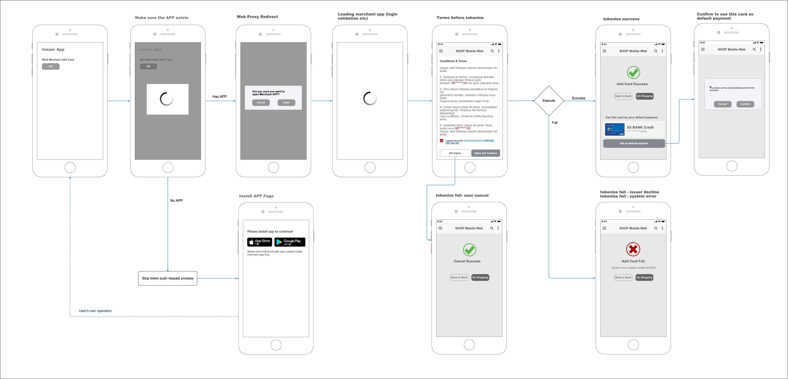
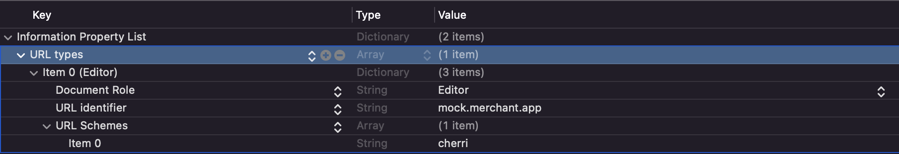

# Tappay-iOS-Tokenpush-Example

TapPay Push Token Example Code for iOS Plateform.

- <font size=1> [Flow](#flow) </font>
- <font size=1> [Prepare](#prepare) </font>
- <font size=1> [Usage - Objective C](#usage-objc) </font>
- <font size=1> [Usage - Swift](#usage-swift) </font>

<a name="flow"></a>
# Flow



<a name="prepare"></a>
# Prepare

1. Make sure issuer app has been installed
2. Setup the URL scheme in the Info.plist of example project

3. Issuer App will launch your App with **tspPushToken** and **cancelUrl**
4. Parse **TspPushToken** and **cancelUrl** from intent data
5. Send <a href="https://docs.tappaysdk.com/tutorial/zh/advanced.html#push-token-api" target="_blank">Push Token API</a>  to Tappay server
6. You will get a suceess response with cardKey and cardToken
7. You may get more card information by <a href="https://docs.tappaysdk.com/tutorial/zh/advanced.html#card-metadata-api" target="_blank">Card Metadata API</a> if you want


# Usage

### If the setup and usage of issuer bank app has already finished

<a name="usage-objc"></a>
### Objective C
### 1. Get push token in AppDelegate or SceneDelegate
```objc
// AppDelegate
- (BOOL)application:(UIApplication *)app openURL:(NSURL *)url options:(NSDictionary<UIApplicationOpenURLOptionsKey,id> *)options {
    // Parsing the url by any method which could return parameters
    NSArray *queryItems = [GlobalFunction queryParameter:url];
    // Post the push token and cancel url to observer
    [[NSNotificationCenter defaultCenter] postNotificationName:@"TSP_Push_Token" object:queryItems];
    return true;
}
```
```objc
// SceneDelegate
- (void)scene:(UIScene *)scene openURLContexts:(NSSet<UIOpenURLContext *> *)URLContexts {
    NSURL * url = [[[URLContexts allObjects] firstObject] URL];
    // Parsing the url by any method which could return parameters
    NSURL * url = [[[URLContexts allObjects] firstObject] URL];
    NSArray *queryItems = [GlobalFunction queryParameter:url];
    // Post the push token and cancel url to observer
    [[NSNotificationCenter defaultCenter] postNotificationName:@"TSP_Push_Token" object:queryItems];
}
```

### 2. Register observer to get push token and post push tokenize request

```objc
- (void)viewDidLoad {
    [super viewDidLoad];
    // Do any additional setup after loading the view.
    [[NSNotificationCenter defaultCenter] addObserver:self selector:@selector(tokenGet:) name:@"TSP_Push_Token" object:nil];
}

- (void)tokenGet:(NSNotification *)notification {
    NSString *pushToken = [notification object];
    if (pushToken.length > 0) {
        [self pushTokenizeWithToken:pushToken successCallback:^(NSDictionary *result) {
            // Do something here if request succeed
        } failureCallback:^(NSDictionary *result,  NSError *error) {
            // Do something here if request failed
        }];
    }
}

- (void)pushTokenizeWithToken:(NSString *)token
              successCallback:(void (^)(NSDictionary *result))successCallback
              failureCallback:(void (^)(NSDictionary *result,  NSError *error))failureCallback{
    ...
    
    NSDictionary *parametersDict = @{@"partner_key":yourPartnerKey,
                                     @"tsp_push_token":token};
                                        
    ...
}
```

<a name="usage-swift"></a>
### Swift

### 1. Get push token in AppDelegate or SceneDelegate
```swift
// AppDelegate
func application(_ app: UIApplication, open url: URL, options: [UIApplication.OpenURLOptionsKey : Any] = [:]) -> Bool {
    // Parsing the url by any method which could return parameters
    let queryItems = URLComponents(string: url.absoluteString)?.queryItems
    // Post the push token and cancel url to observer
    NotificationCenter.default.post(name:NSNotification.Name.init("TSP_Push_Token"), object: queryItems, userInfo: nil)
    return true
}
```
```swift
// SceneDelegate
func scene(_ scene: UIScene, openURLContexts URLContexts: Set<UIOpenURLContext>) {
    if let url = URLContexts.first?.url {
        // Parsing the url by any method which could return parameters
        let queryItems = URLComponents(string: url.absoluteString)?.queryItems
        // Post the push token and cancel url to observer
        NotificationCenter.default.post(name:NSNotification.Name.init("TSP_Push_Token"), object: queryItems, userInfo: nil)
    }
}
```

### 2. Register observer to get push token and post push tokenize request

```swift
override func viewDidLoad() {
    super.viewDidLoad()
    // Do any additional setup after loading the view.
    NotificationCenter.default.addObserver(self, selector: #selector(tokenGet(notification:)), name: NSNotification.Name.init("TSP_Push_Token"), object: nil)
}

@objc func tokenGet(notification : NSNotification) {
    let pushToken = notification.object as! String
    if pushToken.count > 0 {
        pushTokenizeWithToken(token: pushToken) { result in
            // Do something here if request succeed
        } fail: { result,error in
            // Do something here if request failed
        }
    }
}

private func pushTokenizeWithToken(token: String ,success: @escaping (_ result: Dictionary<String, Any>) -> Void ,fail: @escaping (_ result:Dictionary<String, Any>, _ error:Error) -> Void) {
    
    ...
    
    let parametersDict = ["partner_key":yourPartnerKey,"tsp_push_token":token]
    
    ...
    
}
```
